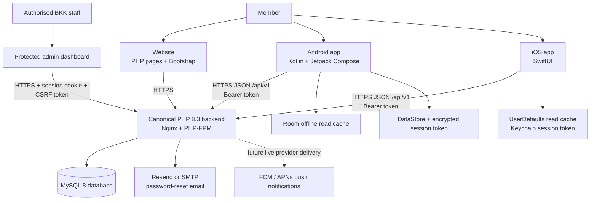
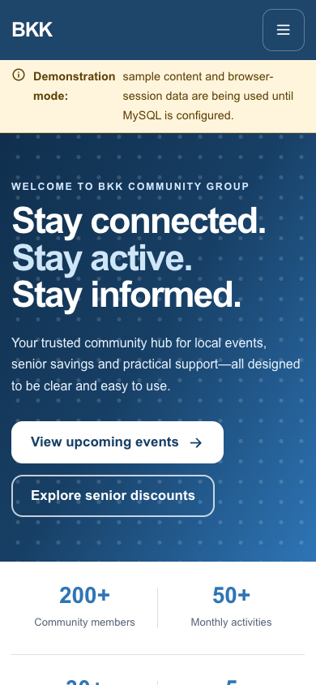
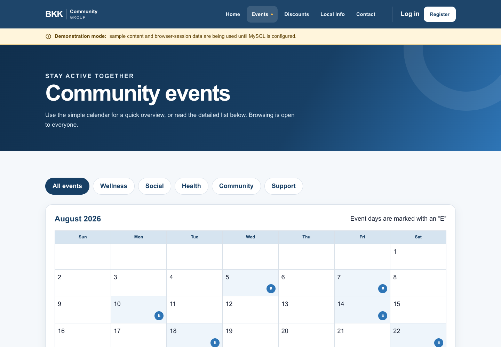
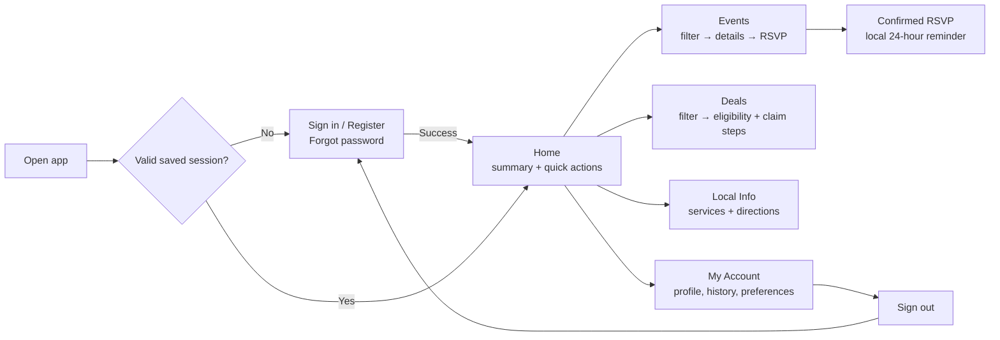
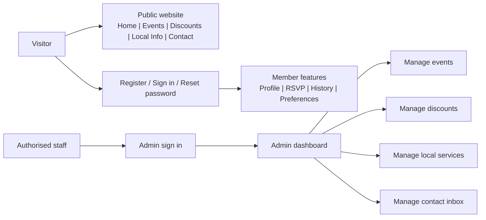
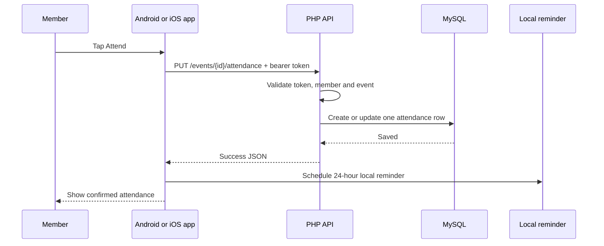
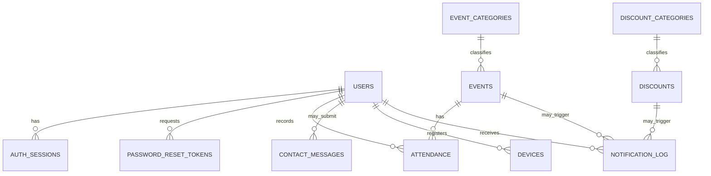

# BKK Community Platform: How It Works and How It Was Built

**Purpose:** This is the group’s plain-language technical handover and viva guide. It explains what each part does, how data moves through the platform, where the source code lives, and what is still not complete.

**Current status:** Development handover. The website, canonical PHP/MySQL API, Android app and iOS app are implemented. Some production evidence and third-party services are still outstanding; they are listed honestly in section 11.

## 1. One-minute explanation

BKK Community is an accessible information platform for older community members. It gives members one place to view community events, RSVP, find discounts, find useful local services, contact the BKK team and manage their own account.

There are three user-facing clients:

| Client | What it is for | Technology |
|---|---|---|
| Website | Public information and protected staff administration | PHP server-rendered pages, Bootstrap 5 and the BKK design system |
| Android app | Member mobile experience | Kotlin, Jetpack Compose, Room, Retrofit and WorkManager |
| iPhone/iPad app | Member mobile experience | Swift, SwiftUI, URLSession and Keychain |

All three use one **canonical backend**: the PHP/MySQL service in the `BKKCommunity-Web` repository. That backend is responsible for the rules, database writes and security. This is important: the Node/Prisma `api/` folder in this handover is an experimental reference only. It is **not** the production server and must not be described as the deployed backend.

## 2. Platform architecture



### The most important idea

The apps do **not** connect directly to MySQL. They call the backend API over HTTPS. The backend validates the request, checks whether the user is allowed to do it, performs the database operation and sends a safe JSON response. This keeps the database password and business rules off users’ phones.

## 3. Visual product tour

These are captures of the implemented responsive website. The information shown is demonstration content until BKK staff approve authentic events, discounts and services.

### Website home page on a laptop/desktop


The home page gives the member a simple starting point: an overview, prominent quick actions, and a limited primary navigation menu. The design deliberately avoids a crowded dashboard.

### Website home page on a phone



This shows that the same web app rearranges into a one-column mobile layout. It is the no-cost way iPhone users can test the platform in Safari and add it to their Home Screen.

### Website events page



The events page uses clear event cards, filters and a predictable reading order rather than hiding important actions inside complex menus.

### Mobile-app screen map



Both the Android and iOS apps use this same mental model: authenticate first, then move through a small set of clearly named destinations. The visual styles are native to Android and iOS, but the features and API contract are shared.

### Website and admin screen map



## 4. What a member can do

| Feature | Website | Android | iOS | How it is stored |
|---|---:|---:|---:|---|
| View events, discounts and local services | Yes | Yes | Yes | MySQL; mobile apps cache readable content |
| Register, sign in and sign out | Yes | Yes | Yes | `users` and `auth_sessions` |
| Reset password using six-digit email code | Yes | Yes | Yes | `password_reset_tokens` |
| RSVP or cancel attendance | Yes | Yes | Yes | `attendance` |
| View attendance history | Yes | Yes | Yes | `attendance` joined to events |
| Update profile and notification preferences | Yes | Yes | Yes | `users` |
| Submit a contact message | Yes | Yes | Yes | `contact_messages` |
| Local 24-hour event reminder | N/A | Yes | Yes | Scheduled on the device after confirmed RSVP |
| Staff manage public information | Yes | No | No | Protected admin pages and MySQL |

The website lets people browse public information before signing in. The mobile apps require sign-in before access to the member platform. RSVP, history, profile changes, account deletion and device registration always require a valid member session.

## 5. Typical user journeys

### A. Sign in

1. A member enters email address and password.
2. The app/website sends the credentials to `POST /api/v1/auth/login` (or the website’s protected form action).
3. The backend verifies the password hash and creates a random session token.
4. Only a SHA-256 hash of the mobile bearer token is stored in MySQL. The raw bearer token is returned once to the mobile app.
5. Android stores its session securely; iOS stores it in Keychain. The website uses a secure, HttpOnly session cookie.
6. Later protected requests send the token/cookie. The backend checks that the session exists, is not expired and has not been revoked.

### B. Password reset

1. The user enters the email address they registered with.
2. The backend always returns the same neutral response, whether or not the account exists. This prevents attackers from discovering which emails are registered.
3. For an existing account, the backend creates a cryptographically random number from `000000` to `999999` and emails it through Resend or SMTP.
4. The code expires after 15 minutes. The database keeps only an HMAC/hash of it, not the readable code.
5. Five incorrect attempts invalidate the code. A successful reset invalidates old codes and revokes all current sessions for that user.

### C. RSVP to an event

1. The signed-in member opens an event and presses **Attend**.
2. The app sends `PUT /api/v1/events/{id}/attendance` with `attending`.
3. The backend checks the member session, validates the event and saves the attendance record.
4. MySQL has a unique constraint on `(user_id, event_id)`, so a user cannot create duplicate RSVPs for the same event.
5. Only after the server confirms success does the app show success and schedule a local reminder. If offline, it must show an error rather than false success.

### D. A staff member publishes a discount

1. An authorised administrator signs into the website administration area.
2. They create or edit a discount with store, offer, eligibility, claim instructions and validity dates.
3. The server validates the fields and saves the record in `discounts`.
4. Website and app users see it on their next refresh. Mobile readable content is cached locally after it is fetched.

This is currently an administrator-managed workflow. Restaurants and pharmacies do not automatically feed discounts into the platform yet; authentic partner information must be verified by BKK staff before publishing.

### Visual: what happens during a secure RSVP



If the API or database cannot confirm the save, the final two steps do not happen. This is how the platform avoids falsely telling a member that an RSVP succeeded.

## 6. Frontend: how the interfaces were built

### Website frontend

The web app is in `BKKCommunity-Web/public/`.

- `index.php`, `events.php`, `discounts.php`, `info.php` and `contact.php` are the public pages.
- `login.php`, `register.php`, `reset-password.php`, `new-password.php` and `profile.php` are account pages.
- `public/admin/` contains the protected staff dashboard and content-management pages.
- `public/assets/css/app.css` holds the BKK visual design and responsive styling.
- Bootstrap is stored locally in `public/assets/vendor/bootstrap/`; no CDN is needed for the basic design.

The user interface follows the documented design language: navy and blue BKK branding, clear cards, large readable text, familiar icons, visible labels, simple five-item navigation and large touch targets. The design aim is not to impress with animation; it is to reduce confusion for older users.

### Android frontend

The Android app is in `BKKCommunity-Clean/android/` and opens directly in Android Studio.

- `ui/BkkApp.kt` and `ui/screens/BkkScreens.kt` provide the Compose navigation and screens.
- `ui/BkkViewModel.kt` holds screen state and calls the repository.
- `data/BkkRepository.kt` decides when to fetch remote data and when to read cached data.
- `data/remote/` contains Retrofit API definitions and JSON models.
- `data/local/` contains the Room database, entities and DAOs.
- `notification/ReminderScheduler.kt` schedules reliable local reminders using WorkManager.

Android supports API 26 and newer. It uses Material 3, scalable text, descriptive icons and 48–56dp control targets. Its build configuration points to `https://www.bkkcommunity.online/api/v1/` by default and blocks cleartext traffic in release configuration.

### iOS frontend

The iOS app is in `BKKCommunity-Clean/ios/` and opens in Xcode through `BKKCommunity.xcodeproj`.

- `Views/` contains the SwiftUI views: Home, Events, Discounts, Services and Account.
- `ViewModels/BKKViewModel.swift` owns the screen state and refresh logic.
- `Services/APIClient.swift` creates HTTPS requests and handles API responses.
- The bearer session is stored in iOS Keychain, not in a normal preference file.
- Last-read public content is cached locally so the app can show it when the network is unavailable.

## 7. Backend: how the server works

The canonical backend is `BKKCommunity-Web`, built with PHP 8.3+, MySQL 8, Nginx and PHP-FPM.

| Backend area | Main files | Responsibility |
|---|---|---|
| Boot/configuration | `app/bootstrap.php`, `app/config.php` | Loads safe environment configuration and security defaults |
| Website authentication | `app/auth.php`, `public/actions.php` | Website sessions, login, registration, CSRF checks and rate limits |
| JSON API | `public/api/v1/index.php`, `app/api.php` | Mobile routes, JSON envelopes and bearer-token protection |
| Database access | `app/repository.php`, `database/` | Prepared queries, schema, seeds and migrations |
| Password reset | `app/password_reset.php`, `app/mail.php` | Random codes, HMAC storage, expiry and provider delivery |
| Abuse prevention | `app/rate_limit.php` | Login/reset/contact request limits |
| Website pages | `public/*.php`, `public/admin/*.php` | Server-rendered public and staff pages |

The API has a consistent response shape:

```json
{ "data": { "example": "successful result" } }
```

or, on failure:

```json
{ "error": { "code": "validation_failed", "message": "Please correct the highlighted fields." } }
```

The primary route groups are:

| Route group | Purpose |
|---|---|
| `/api/v1/auth/*` | register, login, logout, forgot password and reset password |
| `/api/v1/me` | profile, preferences, attendance history and account deletion |
| `/api/v1/events` | event list, event detail and attendance |
| `/api/v1/discounts` | discount list/detail and category filtering |
| `/api/v1/local-services` | local-service listing and type filtering |
| `/api/v1/contact` | validated contact-message submission |
| `/api/v1/devices/fcm-token` | saves an authenticated Android device token and preference state |
| `/health`, `/ready` | process health and database-readiness checks |

## 8. Database: what is stored and why

MySQL is the permanent source of truth. The schema is in `BKKCommunity-Web/database/schema.sql`; migrations are in `database/migrations/`.

| Table | What it stores | Key protection/rule |
|---|---|---|
| `users` | Member profile, password hash, role and preferences | Email is unique; passwords are hashed |
| `auth_sessions` | Active/revoked mobile sessions | Only token hash is stored; sessions expire/revoke |
| `password_reset_tokens` | Reset-code hash, expiry and failed attempts | Raw code is never stored |
| `event_categories`, `events` | Event categories and event details | Event timing and status validated |
| `attendance` | RSVP status per event/member | One record per user/event |
| `discount_categories`, `discounts` | Discount categories and offers | Valid dates and active state |
| `local_services` | Pharmacies, clinics, shops, support and transport | Filtered by service type |
| `contact_messages` | Enquiries from members/visitors | Admin can track new/read/resolved state |
| `devices` | Android notification token and enabled state | Device token is unique |
| `notification_log` | Provider delivery attempts/results | Supports future notification audit trail |
| `api_rate_limits` | Hashed abuse-limit buckets | Prevents repeated hostile requests |

### Visual: core database relationships



## 9. Security and privacy decisions

These are intentional design decisions, not buzzwords:

- **HTTPS only:** production traffic is encrypted. Android disallows cleartext traffic.
- **No direct database access from apps:** MySQL credentials stay on the server.
- **Passwords are hashed:** the server uses PHP password hashing/verification, not readable passwords.
- **Bearer tokens are hashed in MySQL:** theft of the database does not reveal a ready-to-use mobile token.
- **iOS Keychain / Android secure storage:** mobile tokens are not placed in ordinary app text files.
- **CSRF protection:** browser-changing requests require a CSRF token.
- **Secure web cookies:** website session cookies are HttpOnly and SameSite.
- **Rate limiting:** login, registration, reset and contact endpoints are throttled by IP/account buckets.
- **Prepared database queries and validation:** protects against SQL injection and malformed input.
- **No fake offline writes:** RSVP and other protected writes do not show success unless the API confirms a saved database operation.
- **Secrets outside Git:** `.env`, database credentials, Resend keys, Firebase files, Android signing keys and Apple provisioning files are not committed.

## 10. How it is run and deployed

### Development

| Component | Open/run with |
|---|---|
| Website/API | Visual Studio Code plus PHP 8.3+ and MySQL 8 |
| Android | Android Studio, JDK 17+ (the project uses JVM target 17) |
| iOS | Xcode on macOS |

For the website locally, configure a local `.env` outside Git, then start PHP with:

```bash
php -S 127.0.0.1:8080 -t public public/router.php
```

The repository’s Visual Studio Code task can start this for you. The site is interpreted and served by PHP; it is not “compiled in Visual Studio.”

### Production

The canonical service is deployed on Railway behind HTTPS. The production Docker image uses Nginx and PHP-FPM, installs PHP MySQL support and runs safe database migrations before reporting readiness. MySQL is configured with hosting environment variables, not source files.

The mobile release base URL is:

```text
https://www.bkkcommunity.online/api/v1/
```

For safety, the mobile app should be tested against `/health` and `/ready` before a build is handed to users. `/ready` must not report success when the database is unavailable.

## 11. Testing: how we prove behaviour

Testing happens in layers:

1. **Code checks:** PHP syntax checks, Android unit tests/lint/APK assembly, API contract tests.
2. **Integration checks:** migration, registration, login, logout, duplicate RSVP prevention, cancellation, account deletion and admin CRUD/read-back.
3. **User-interface checks:** loading, populated, empty, error and offline states; navigation and no horizontal overflow on small screens.
4. **Security checks:** secret scan, access-control checks, CSRF, session revocation, rate limits and safe logging.
5. **Accessibility and UAT:** TalkBack/VoiceOver, 200% text scaling, contrast, large targets and at least six elderly participants.

The critical answer for an examiner is: automated tests prove some technical rules, but they do not replace real elderly-user testing or real-device accessibility evidence.

## 12. Honest limitations and release gates

Do **not** say these are complete unless evidence is captured:

- authentic BKK events, discounts, partner details, branding assets and imagery;
- fresh real-device evidence on both Android and iPhone;
- TalkBack, VoiceOver and 200% text-scale evidence;
- six-person elderly-user UAT, with at least 80% independent task completion and 4/5 average feedback;
- Firebase/APNs credentials and real push-notification delivery evidence;
- automated encrypted backups, uptime monitoring and an edge/WAF service;
- final POPIA/privacy notice, data-retention policy and stakeholder sign-off.

Password-reset email works only when a verified Resend domain or working SMTP sender is configured in Railway. Code alone cannot make a provider deliver email.

## 13. Common examiner questions and strong answers

| Question | Answer |
|---|---|
| Why use one backend for web and mobile? | It keeps the business rules, security and data consistent. An RSVP made from Android is immediately available to the website/admin dashboard because all clients use the same database through the same API. |
| Why not let the mobile app connect straight to MySQL? | That would expose database credentials and allow users to bypass validation and authorisation rules. The API is the controlled security boundary. |
| How do you prevent duplicate attendance? | The database has a unique `(user_id, event_id)` constraint and the API updates the same attendance record instead of creating another one. |
| How is the reset code generated safely? | PHP uses `random_int`, which is cryptographically secure. The six-digit code is email-bound, expires after 15 minutes, is invalidated after five wrong guesses and is stored only as an HMAC/hash. |
| Why show the same reset response for any email? | To prevent account enumeration: attackers should not learn whether an email address has an account. |
| What happens if a person has no internet? | Mobile apps can read previously cached events, deals and services. Any data-changing action, such as RSVP, is blocked until the server confirms it. |
| How is the platform usable for elderly members? | We limit primary navigation, use large controls and readable text, give visible labels, avoid colour-only status, keep actions within a few steps and plan real elderly-user UAT. |
| What does the admin dashboard do? | It allows authorised staff to create, update and manage published events, discounts, services and contact messages without editing source code. |
| What is not production-ready yet? | Real notification delivery evidence, real accessibility/UAT evidence, approved live content and final operational/legal controls. We do not claim those are complete. |
| What is the difference between the Node API and PHP API folders? | Node/Prisma is an experimental development reference. The deployed API used by the website and mobile apps is the PHP/MySQL API in `BKKCommunity-Web`. |

## 14. Group presentation checklist

Before presenting, every member should be able to explain:

- the difference between frontend, backend, API and database;
- why the PHP/MySQL repository is canonical;
- the login → token/session → protected request flow;
- the password-reset security controls;
- duplicate RSVP prevention;
- cached reading versus online-only writes;
- how an admin publishes verified information;
- the honest list of remaining release gates.

If the group cannot demonstrate something live, say: **“The code path is implemented, but we have marked real-world verification as outstanding rather than claiming it has been completed.”** That is much stronger than guessing.
