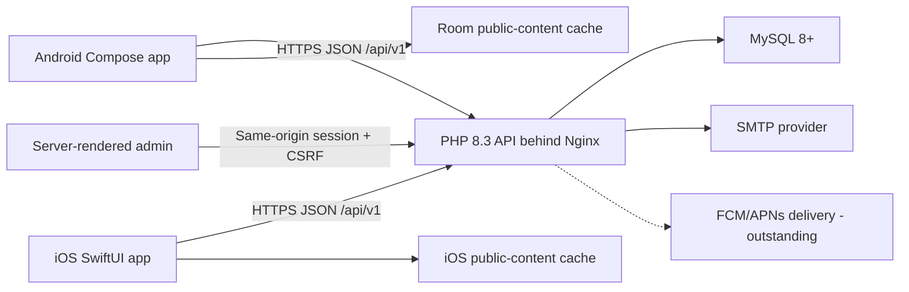

# BKK Community Platform — Project Documentation

Version: 1.0 development handoff  
Updated: 14 August 2026  
Status: canonical PHP/MySQL release backend deployed; external credentials, authentic content and human/device evidence incomplete

## 1. Project purpose

The BKK Community Platform gives older community members one accessible place to discover events, confirm attendance, find senior discounts, locate useful services and contact the community team. A small administration dashboard lets authorised staff maintain the public information.

The Phase 2 high-fidelity Android home screen is the visual source of truth. The product uses a navy BKK header, personalised daily summary, gold discount banner, four quick actions, schedule cards and five primary destinations: Home, Events, Deals, Info and Me.

## 2. Goals and success criteria

The project should:

- require registration or verified authentication before platform access;
- restore a valid secure session without exposing platform content to signed-out users;
- never claim an RSVP or notification succeeded without provider confirmation; fail reset configuration closed, keep account-existence responses neutral and invalidate any code whose delivery fails;
- remain usable with larger text, screen readers and reduced technical confidence;
- give the group one reproducible Android, iOS, API, database and admin handoff;
- protect personal information and privileged administration functions.

Release success still requires all Must requirements to pass, no critical defects, at least 80% independent task completion during UAT and an average elderly-participant rating of at least 4/5.

## 3. Users and roles

| Role | Capabilities |
|---|---|
| Signed-out user | Register, sign in or request a password-reset code |
| Member | Browse events, discounts and services; RSVP; use reminders; manage profile/preferences/history and contact support |
| Administrator | Maintain events, discounts, local services and contact-message status |

Administrators use the same account system and every protected admin page rechecks the current database role. Administrator promotion/creation is a controlled command-line operation; the production UI does not expose role management.

## 4. Functional scope

### Public content

- Event list, date/category filtering, details, location and directions.
- Discount list, categories, eligibility and claim instructions.
- Local-service list, categories, phone, address, hours and directions.
- Contact submission with validation and rate limiting.
- Offline readable cache in the Android app; iOS retains last fetched content in `UserDefaults`.

### Accounts

- Email/password registration and login.
- Database-backed IP and account throttling for login, registration and reset attempts.
- Logout backed by server-side session revocation.
- Six-digit password reset code, valid for 15 minutes, bound to member ID and normalised email using an HMAC.
- Five failed code guesses invalidate the active code.
- Successful reset revokes every existing session.
- Profile/preferences and account deletion endpoints.

### Attendance and reminders

- One attendance record per member/event enforced by a unique database constraint.
- RSVP writes require a successful API response; mobile clients do not show offline success.
- Android schedules a local 24-hour reminder only after a confirmed RSVP.
- Device-token/preferences storage is implemented. Actual FCM/APNs provider delivery is not yet implemented in the canonical PHP release backend and remains a release gate.

### Administration

- Admin-only event, discount, local-service and contact-inbox management.
- Strict dates, lengths, colours, ordering and identifiers.
- Same-origin HttpOnly/SameSite session cookies and CSRF protection for browser mutations.
- The administrator UI does not log request bodies or credentials.

## 5. Non-functional requirements

### Accessibility

- Android supports API 26 and later.
- Body content targets 18sp and primary controls target at least 48–56dp.
- Material/SF Symbols replace unreliable emoji glyphs for interface meaning.
- Status includes text/icons and is not communicated by colour alone.
- TalkBack, VoiceOver, switch control, 200% font size and contrast still require manual evidence.

### Security and privacy

- Release traffic must use HTTPS.
- Mobile bearer tokens expire after 30 days; only SHA-256 token hashes are stored and every request checks a revocable database session.
- Android stores the bearer token with Android Keystore AES-GCM; iOS stores it in Keychain.
- Passwords use PHP's supported `password_hash`/`password_verify` implementation.
- Password reset stores only an HMAC, never the six-digit code.
- The canonical API is same-origin/native-client only, rejects bodies over 32 KB, sends strict security headers and uses route-specific database-backed limits.
- Secrets, Firebase files, signing keys, builds and machine files are excluded from Git.
- Contact message bodies, emails, reset codes and tokens are not written to application logs.

### Reliability

- Public Android refresh replaces all Room content in one transaction.
- Readiness checks verify database connectivity.
- API errors use a stable JSON envelope and avoid logging credentials, codes and message bodies.
- Numbered, tracked migrations deploy before database readiness succeeds.

## 6. Architecture

Android uses Jetpack Compose, Navigation Compose, ViewModel/StateFlow, Retrofit/OkHttp, Room, DataStore, WorkManager and Firebase Messaging. iOS uses SwiftUI, URLSession, Keychain, UserNotifications and local caching. The canonical schema and numbered migrations are in `kxcy77/BKKCommunity-Web`; the bundled Prisma service is experimental reference code.

## 7. Data model

| Table | Purpose | Critical constraint |
|---|---|---|
| `users` | Profile, password hash, role and preferences | unique email |
| `auth_sessions` | Revocable hashed bearer tokens | unique token hash |
| `password_reset_tokens` | HMAC reset codes and attempt counters | unique code hash, expiry and used state |
| `events` | Community activities | end time validated after start |
| `attendance` | Member RSVP state | unique member/event pair |
| `discounts` | Senior deals | valid-until not before valid-from |
| `local_services` | Community and health services | required contact fields |
| `contact_messages` | Submitted support requests | retention policy still required |
| `devices` | Mobile notification registration tokens | unique token |
| `notification_log` | Future provider acceptance/failure records | unique dedupe key |
| `api_rate_limits` | Hashed IP/account request buckets | unique bucket key |
| `schema_migrations` | Applied migration names | unique migration name |

## 8. API contract summary

All responses use either `{ "data": ... }` or `{ "error": { "code": "...", "message": "..." } }`. Protected routes require `Authorization: Bearer <token>`.

- `/api/v1/auth`: register, login, logout, forgot-password and reset-password.
- `/api/v1/me`: profile, preferences, attendance history and deletion.
- `/api/v1/events`: list, details and attendance.
- `/api/v1/discounts`: list and details.
- `/api/v1/local-services`: filtered listing.
- `/api/v1/contact`: validated support messages.
- `/api/v1/devices`: token registration.
- `/admin`: same-origin protected website content management; it is not a public JSON route.

See [the canonical API documentation](https://github.com/kxcy77/BKKCommunity-Web/blob/main/docs/API.md) for request-level details. `api/README.md` documents only the experimental Node implementation.

## 9. Configuration and deployment

No live secret belongs in source control. Database/schema readiness is checked before deployment becomes healthy; password-reset configuration is validated before issuing a code. Production needs:

- a managed MySQL database and separate `DB_HOST`, `DB_PORT`, `DB_NAME`, `DB_USER` and `DB_PASSWORD` values;
- a separate 32+ character `RESET_CODE_SECRET`;
- SMTP host, user, password and verified From address;
- authorised Firebase/APNs configuration when provider delivery is implemented;
- HTTPS API hostname configured in Android/iOS release settings;
- Android signing material and Apple team/provisioning profiles outside Git.

Railway hosts the canonical PHP API and MySQL. Health/readiness, mobile authentication and RSVP were witnessed; production remains incomplete until a fresh empty-database rehearsal, authenticated live admin CRUD and real password-reset email delivery have been witnessed.

## 10. Testing strategy

- Unit: validation, presentation rules and configuration fail-closed behaviour.
- Contract: email + reset code, attendance statuses, administrator booleans and date formats.
- Integration: fresh MySQL migration, auth lifecycle, duplicate RSVP, admin CRUD and account deletion.
- UI: navigation, scrolling, empty/loading/error/offline/populated states and deep links.
- Security: dependency audit, secret scan, rate limits, access control, session revocation and log review.
- Accessibility: TalkBack, VoiceOver, keyboard/switch control, 200% text, contrast and 48dp targets.
- UAT: at least six elderly BKK participants using realistic devices and approved data.

## 11. Known limitations and honest release status

The current package is a hardened development handoff, not a signed production release. These cannot be invented in code and remain outstanding:

- authentic approved BKK logo, images, events, discounts, services and contact details;
- fresh empty-MySQL migration rehearsal and authenticated live admin CRUD evidence;
- live password-reset email delivery through a verified sender;
- real Firebase projects and Android/iOS device delivery evidence;
- iOS remote notification registration/delivery (local reminders are implemented);
- physical Android and iPhone tests;
- TalkBack, VoiceOver and 200% text evidence;
- six-person elderly-user UAT and client sign-off;
- retention policy, privacy notice and POPIA/legal review.

The ruthless conclusion: the critical false-success and secret-handling defects were fixed, but calling the product “production ready” before those external and human gates pass would still be dishonest.
